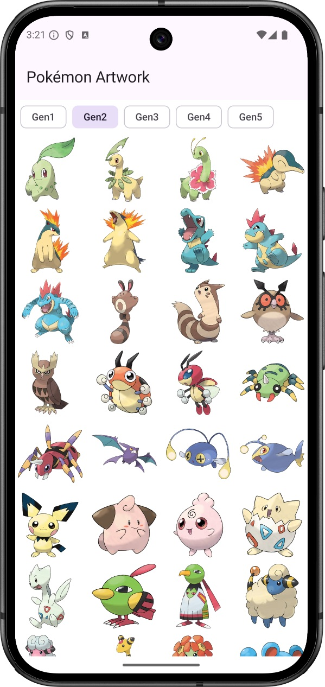
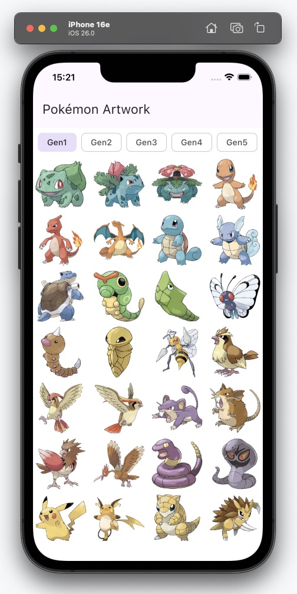
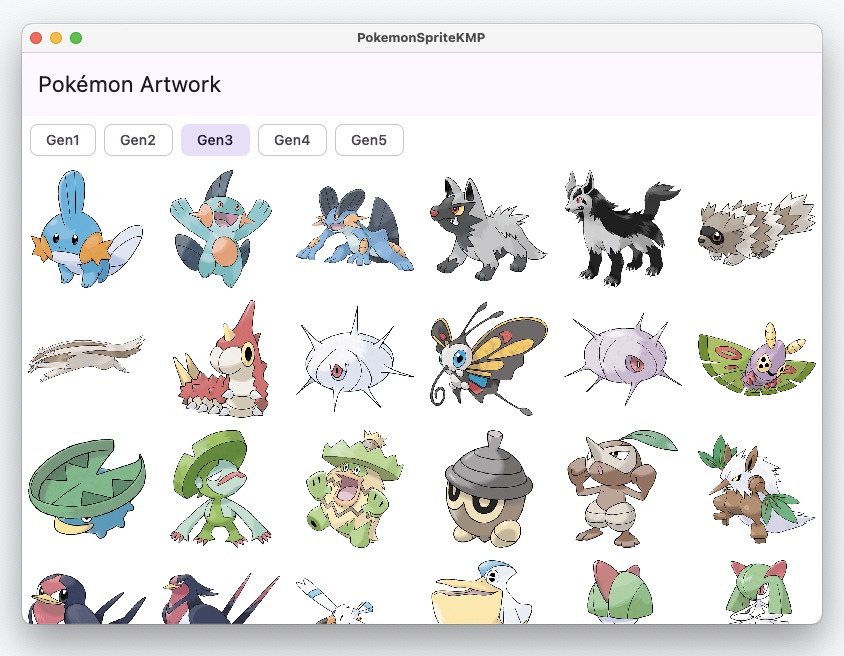

# PokemonSpriteKMP

This project is a Kotlin Multiplatform project that displays Pokémon artwork from the PokeAPI.

## Features

- Display pokemon sprites from different generations
- Support for Android, iOS, and Desktop

## Tech Stack

- [Kotlin Multiplatform](https://kotlinlang.org/docs/multiplatform-mobile-getting-started.html)
- [Compose Multiplatform](https://www.jetbrains.com/lp/compose-multiplatform/)
- [PokeAPI](https://pokeapi.co/)
- [Coroutines](https://kotlinlang.org/docs/coroutines-overview.html)
- [ViewModel](https://developer.android.com/topic/libraries/architecture/viewmodel)
- [Koin](https://insert-koin.io/)
- [Coil](https://coil-kt.github.io/coil/)

## Screenshots
### Android

### iOS

### macOS
